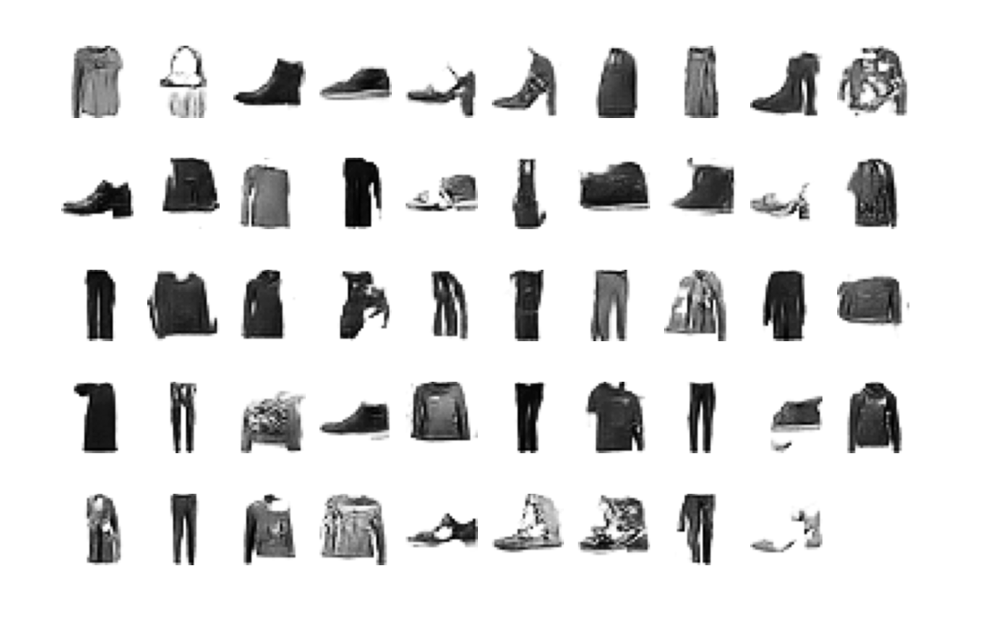
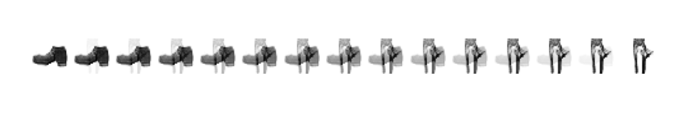
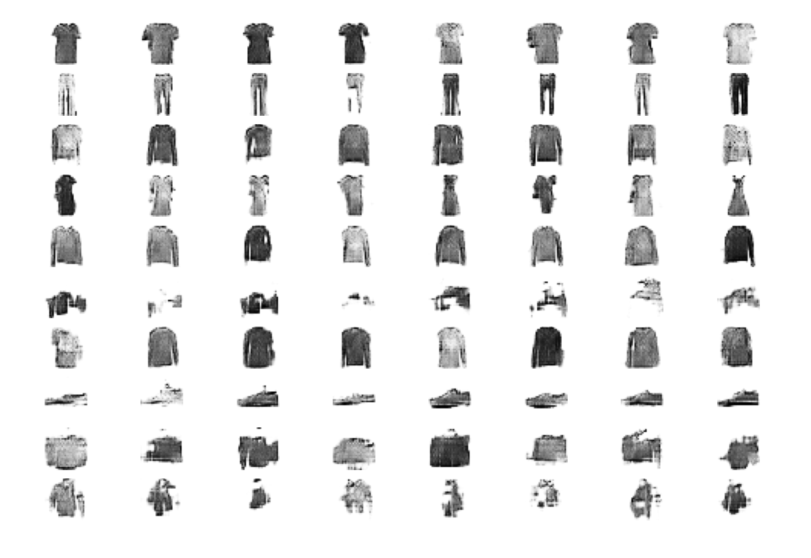
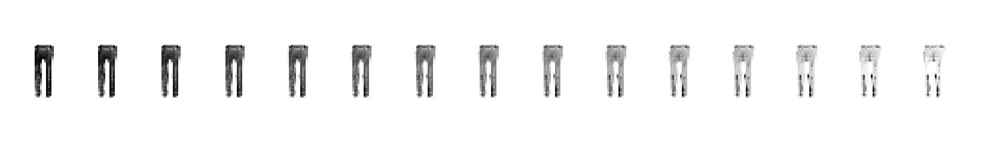

# GAN-cGAN-experiments
Implementing a GAN and conditional GAN to familiarize myself w/ generative models. 

## Dataset & Model
The unconditional and conditional GANs have been trained on the MNIST-fashion dataset for 15 and 3 epochs, respectively.

The generator of the unconditional GAN uses transposed-convolutional and fully-connected layers to project the random latent vector input to the appropriate dimensions before upsampling to form a 'fake' image
The discriminator mirrors this architecture but instead uses regular convolutional layers to downsample input images and ultimately classify the image as either 'real' (i.e. from the actual dataset distribution) or 'fake' (i.e. fabricated by the generator)

The conditional GAN uses the same components but additionally handles class labels on which the outputs are conditioned. This is done so that, during inference, the user can specify which specific object class they want the trained generator to produce. 

## Cool outputs
1. Unconditional GAN generator outputs after 15 training epochs

2. Unconditional GAN latent space interpolation between pants and a boot

3. Conditional GAN generator outputs after 3 training epochs (one object class/row)

4. Conditional GAN latent space interpolation between two pairs of pants (same object class)


## Running the trained model
To anyone other than me who has made it up to here, you can run the trained generator models by forking the repo and running 
```
python inference(_cgan).py
```
in /gan or /cgan. You may need to play around with relative filepath in inference.py so that it points to either trained_generator5 or trained_conditional_generator. Or just click the run icon in VS Code with inference.py open.

Make sure you have the following installed:
- python 3
- tensorflow 2(.7)
- matplotlib
